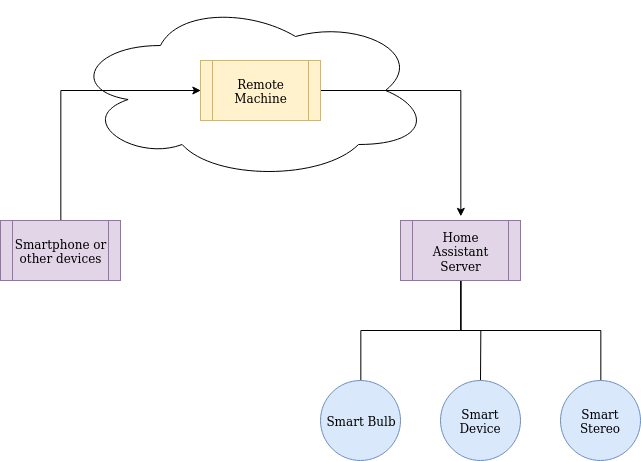
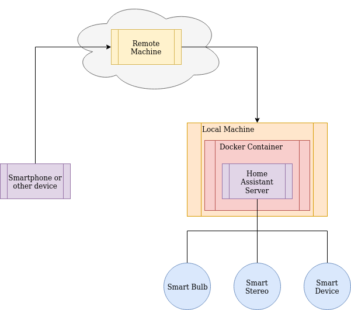

[singularitynet-home]: https://www.singularitynet.io
[author-home]: http://alysson.thegeneralsolution.com

# home-assistant-scheme-api

This repository contains a home assistant Scheme API, which allows calling for services available on each of the existing smart devices connected in the Home Assistant.

# get started

You need to have a Guile environment to run Scheme scripts, the Home Assistant Server installed, and at least one smart device to use the Home Assistant Scheme API. This API was tested on a Ubunto 18.04.

## Installing the Guile environment

You can install guile with the following steps.

1) Download guile
```
ftp://ftp.gnu.org/gnu/guile/guile-2.2.6.tar.gz
```
2) Unpack

```
zcat guile-2.2.6.tar.gz | tar xvf -
```

3) Install

```
cd guile-2.2.6
./configure
make
make install 
```

## Installing the Home Assistant

To install the Home Assistant, make sure that you have python 3.x, build-essential, and ssh installed.

Run the following command to install the Home Assistant

```
sudo pip3 install homeassistant
```

# Adding a Device: Yeelight Bulb Special Case

As a basic example, I am going to show how to add a Yeeligh bulb, since it involves a manual procedure that may be required to some devices. For all the others, it is most likely for the Home Assistant to detect them automatically.

***If you have another device that can be detected automatically, skip this section.***

Do the following to allow the Home Assistant to see your device.

1) Connect the Yeelight bulb into the same network as your Home Assistant server by following its manual. You will likely need to install a Yeelight app on your smartphone. 
2) Add the following lines to the end of the Home Assistant *configuration.yml* file locate in */home/***your user***/.homeassistant/* 

```
yeelight:
 devices:
 x.x.x.x:
 name: Office
```
Where *x.x.x.x* is the IPv4 address of your Yeelight Bulb.

3) Save and close the file.
4) Make sure that your Yeelight bulb device has the Lan mode enabled in the Yeelight app.

# Running the Home Assistant server

the Home Assistant server can be run with the following.

```
hass --open-ui --log-file hass.log
```

This command will run the Home Assistant server, with the UI support, and will save the logs from the server in the *hass.log* file.

## Obtaining an access token to be able to perform command line calls to the Home Assistant server

The access token is an essential part of your Home Assistant server, it will allow you to call for services from the service that can manipulate your connected devices.

Do the following to generate an access token.

1) Open a Home Assistant server.
2) Enter its UI by typing localhost/8123 in a web-browser of your preference.

 * The first time you, it will ask you to create a new account. After creating the account, log-in to the system and do the following.

3) Click on your user name at the bottom of the left menu tab.
4) Scroll down to the bottom of the content and you will see a section called ***Long-Lived Access Tokens***.
5) Click *create token* and give it a name.
6) Copy the token that will be shown to you.

 * keep that token because it is most likely that you will not be able to see it again.

## Getting your entity ID

 An entity ID is necessary to send a command to any device, thus for our use case you need to get the entity ID of the connected Yeelight. 
 
 Entity IDs usually posses the form ***domain.entity***. To see all the available IDs click on the ***configuration*** button on the bottom of the left menu and then go to the ***entities*** section. 
 
In case your entity ID is not being shown there, try to get it from the ***overview*** view by clicking in the ***overview*** button on the top of the left menu.

# Using the Scheme API

Use the commands bellow to call the Home Assistant server through the Scheme API.

1) clone ***https://github.com/Ophien/home-assistant.git***
1) Open a Guile environment by typing ***guile*** inside the ***home-assistant/api*** folder in a terminal.
2) With the Guile environment running, use the following commands to load the modules, set the server address, and access token.

```
(load "hass.scm")
(load-modules (hass-services-api))
(hass-set-server-adress "IPv4 server address")
(hass-set-token 'Long-Lived Access Tokens)
```

Where ***IPv4 server address*** is your server IPv4 address and ***Long-Lived Access Tokens*** is your previously generated access token.

3) To call a command do.

```
(hass-call-service ***domain*** ***entity*** ***command***)
```

* Where, the ***domain*** is the first name of the Yeelight, ***entity*** is the second one, and ***command*** is the service to be called. For example, if your Yeelight has the entity ID ***light.office*** in your Home Assistant, then your *domain* is ***light*** and your entity is ***office***.

4) For our use-case, to call the ***turn_on*** command from the configured Yeelight device from this Readme do the following.

```
(hass-call-service "light" "office" "turn_on")
```

5) To see all available devices, entities, and services, you get use.

```
(hass-get-available-services)
```

It will return a ***json*** string which contains all entities and their respective services.

# Docker

It is also possible to run the Home Assistant server inside a docker container. To do so, use the ***docker.sh*** the script in this project's root directory. 

```
chmod +x docker.sh
./docker.sh
```

Through this command, it is possible to create a docker image named ***hass-img*** for the hass container based on the ***Python:3***. Also, a container named ***hass*** will automatically be launched after.

# SSH Tunel for remote access to your Home Assistant server

Through the following steps, you can bridge the commands from anywhere to your locally deployed hass server.

Bellow, there is a basic diagram so you can understand what will happen. 

1) The Home Assistant server will be running in your house or whatever locally and will be integrated with all your devices.
2) Next, you will have a tunnel in your remote machine that can be received and redirect any command to the Home Assistant server in your house.
3) Finally, you will be able to have access to your local server through your remote machine opened tunnel port.

<p align="center">

</p>

Firstly, make sure you have an SSH host configured in a ***REMOTE MACHINE***.

Secondly, create a private/public key pair for a user in your remote server machine and add your public key to it.

Third, put the SSH configurations for your remote server into the ***config*** file inside the ssh_tunel folder.

You need to provide three variables:

1) SSH_TUNEL_MIDDLEWARE_PORT
    * the port in your remote machine from where the information will be tunneled.
2) SSH_TUNEL_MIDDLEWARE_USER
    * the user name to log-in into your remote machine.
3) SSH_TUNEL_MIDDLEWARE=bh2.singularitynet.io
    * your remote machine's domain name.

Fourth, put your private key into the ***private-key-hass*** located in the ***ssh_tunel*** folder.

Now, to launch the Home Assistant you have two options.

1) run it directly in a host machine with the following.

    ```
    ssh -nN -R <remote port>:localhost:8123 -o StrictHostKeyChecking=no -i <p-key> <remote user>@$<remote address> &

    hass --open-ui
    ```

    These commands will open an SSH tunnel between the remote server and your Home Assistant server,

    where ***8123*** is the hass default port, \<remote port\> is the port used by the tunnel in your remote machine, \<p-key\> is your private key used to log-in into your remote machine, \<remote user\> and \<remote address\> are your user and remote machine address, respectively.

2) Use the ***docker.sh*** script again to run it automatically inside a docker container.

    ```
    ./docker.sh
    ```

    * In this case, the diagram for your deployment will look like the following.

<p align="center">

</p>

# Author

[Alysson Ribeiro da Silva][author-home] - *Maintainer* - [SingularityNET][singularitynet-home]